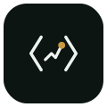
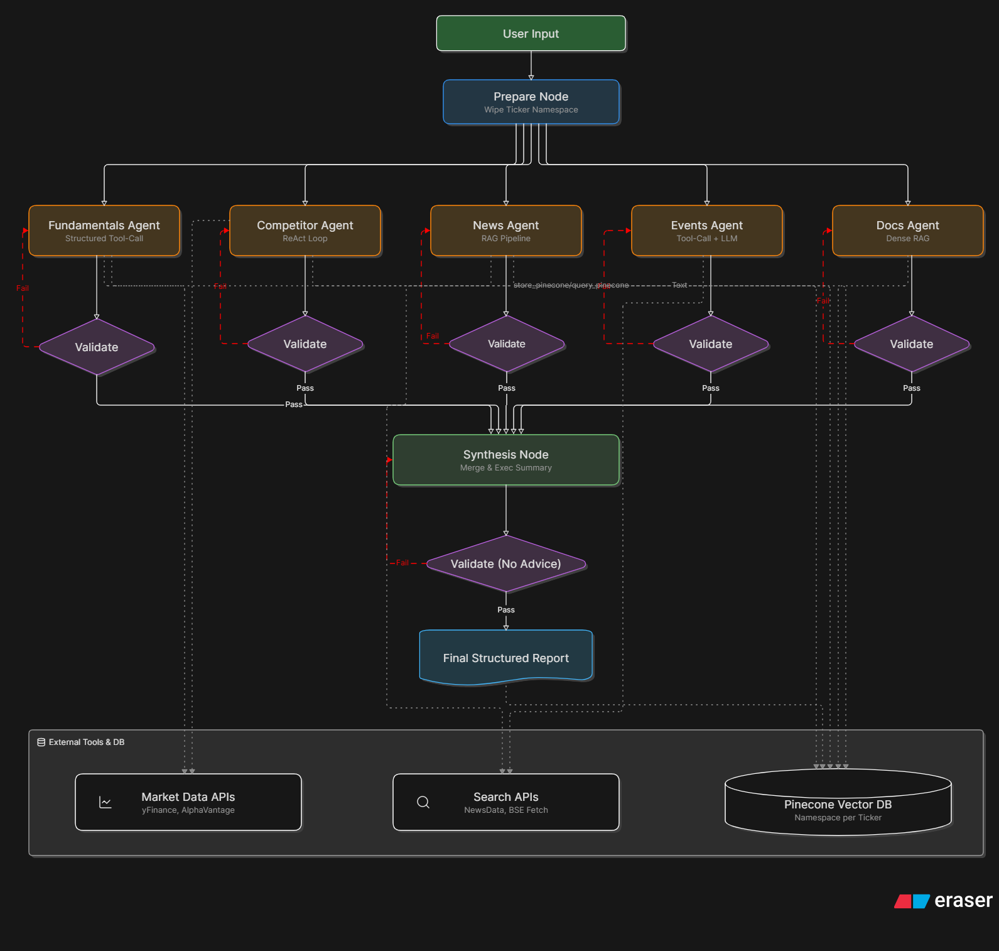
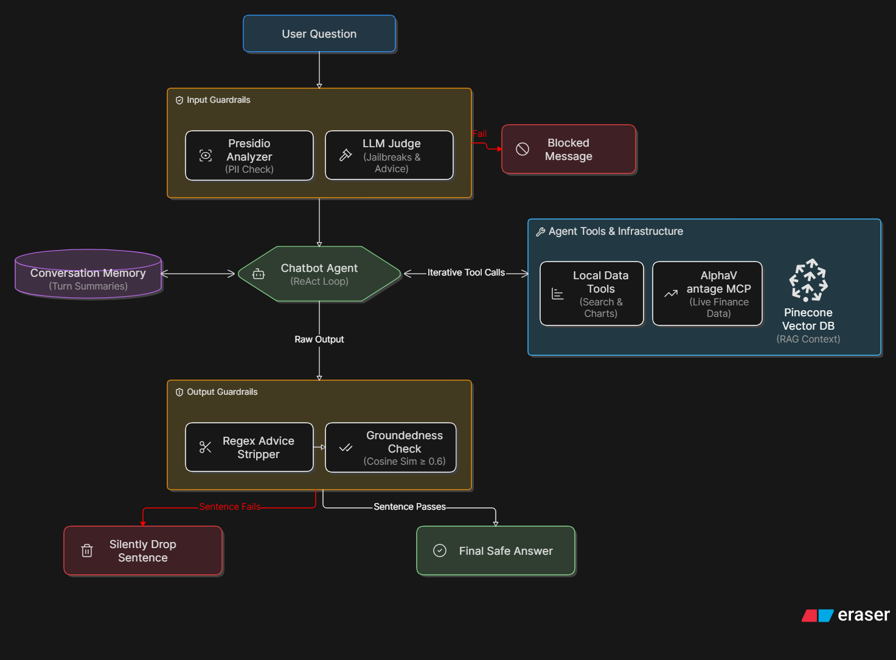
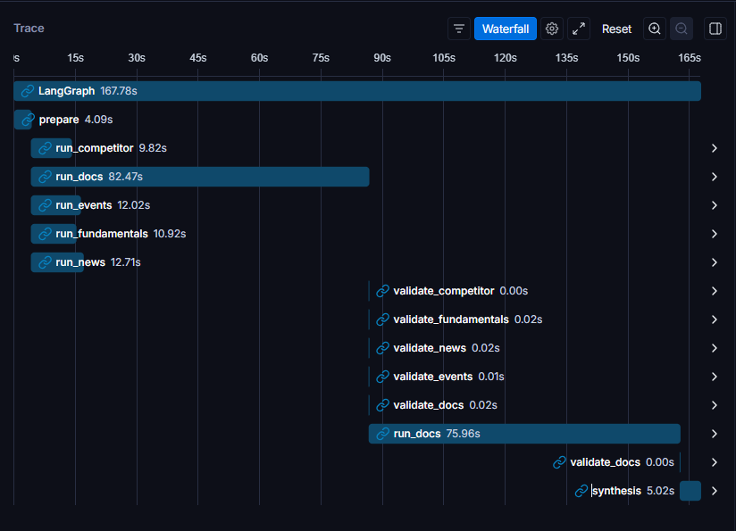

<div align="center">



# Multi-Agent Equity Analyst

**A multi-agent Indian-equity research system.** Five specialist LLM agents research an NSE/BSE stock in parallel, self-correct against a validation loop, and synthesize one cited report — then a guardrailed RAG + ReAct chatbot answers follow-up questions grounded only in what was indexed.


</div>

> **Scope by design:** NSE/BSE equities only · read-only data everywhere · **no buy/sell/hold/recommend language anywhere** · every chatbot claim is cited or stripped. This is a research-skills demo, **not** investment advice.

---

## 🎬 Demo

<!-- TODO: replace with your demo thumbnail + video link -->
[](https://your-demo-video-link)

**▶️ Try it live:** <!-- TODO: HuggingFace Space URL -->[Multi-Agent Equity Analyst on 🤗 Spaces](https://huggingface.co/spaces/your-space)

<sub>Hosted on a free HuggingFace Space — it sleeps when idle and takes ~30s to wake on first request.</sub>

---

## 💡 The Idea

Retail equity research is scattered across filings, concalls, news, and peer data — slow to assemble and easy to bias. This system treats research as an **orchestration problem**:

- **Specialist agents, not one mega-prompt** — competitor, news, events, financial docs, and fundamentals each run independently with the retrieval/tooling pattern that fits their job.
- **Self-correcting** — each agent's output is validated; a failed check feeds the reason back and retries (up to 3×) before the report is assembled.
- **Grounded or gone** — the chatbot answers only from the ticker's indexed namespace, and any sentence it can't trace to a retrieved source is stripped by the output guardrail.

---

## 🧠 What This Project Demonstrates

| Skill | Where it lives |
|---|---|
| **Multi-agent orchestration** | LangGraph parallel fan-out → deferred synthesis (`workflow/graph.py`) |
| **Self-correction / reflection** | Per-agent `run → validate → retry` loop, max 3 attempts (`workflow/edges.py`) |
| **RAG** | News & Financial Docs agents; chatbot retrieval (`agents/`, `chatbot/`) |
| **ReAct** | Competitor Intelligence agent + chatbot tool loop |
| **Tool-calling** | Event Timeline agent; 10 chatbot tools (`chatbot/chatbot_tools.py`) |
| **Rule-based guardrails** | Presidio PII + LLM judge (input); advice-strip + groundedness (output) (`guard/`) |
| **Reranking** | Pinecone top-k → Cohere rerank top-5 (`tools/rerank_tools.py`) |
| **MCP integration** | Alpha Vantage remote MCP tools via `langchain-mcp-adapters` |
| **Observability** | LangSmith traces per agent/turn, tagged `pass \| fixed \| blocked \| error` |
| **Evaluation** | RAGAS faithfulness + context precision over a golden set (`eval/ragas_eval.py`) |

---

## 🏛️ Architecture — Agentic Report Workflow

<!-- TODO: export the Eraser diagram to assets/diagram-workflow.png -->


A ticker fans out to **five specialists running in parallel**. Each is a two-step node — `run` then `validate` — and a conditional router either **retries** (injecting the validator's feedback, up to 3 attempts) or **joins**. Synthesis is deferred until all five branches settle, then merges them into one structured report.

- **Shared Pinecone index** `stock-research` (serverless), **one namespace per ticker** (e.g. `HDFCBANK`), vectors tagged with `source_type` (`news \| docs \| events \| competitor \| report`). Each agent filters by its own `source_type`.
- **Embeddings:** Pinecone-hosted `llama-text-embed-v2` (no local model).
- **Report ≠ guarded:** the synthesized report is **not** run through guardrails — agents rely on their system prompts for no-advice tone. Guardrails gate the **chatbot only** (below). This is a deliberate, honest scope choice.

| Agent | Pattern | Output section |
|---|---|---|
| Fundamentals | structured tool-calling | Company & Fundamentals |
| Competitor Intelligence | **ReAct** | Competitive Landscape |
| News Analysis | **RAG** | News Analysis |
| Event Timeline | tool-calling + LLM | Event Timeline |
| Financial Docs | **RAG** | Financial Documents |
| Synthesis | aggregation (no reasoning loop) | Executive Summary + merge |

---

## 💬 Architecture — Chatbot + Guardrails

<!-- TODO: export the Eraser diagram to assets/diagram-chatbot.png -->


Every turn is gated on **both** ends:

1. **Input guardrail** — Presidio PII detection (email, phone, PAN, Aadhaar, …) + a Groq `llama-3.1-8b-instant` judge classifying offensive / jailbreak / advice-request. Fails **closed**.
2. **ReAct agent** — up to 8 tool rounds over `search_research` (Pinecone k=10 → **Cohere rerank top-5**), live price, fundamentals, price history, charts, news, and Alpha Vantage MCP tools.
3. **Output guardrail** — advice language stripped by context-aware regex, then **per-sentence groundedness**: each sentence must clear cosine ≥ 0.6 against *this turn's* tool outputs, match a cited number, or be the mandated refusal — otherwise it's dropped.

---

## 🛡️ Guardrails in Action

<!-- TODO: swap for a real screenshot/example from a run -->

| User asks | System does |
|---|---|
| *"Should I buy HDFC Bank right now?"* | **Blocked at input** — advice-request → safe refusal, no LLM call |
| *"What's my PAN ABCDE1234F's exposure?"* | **Blocked at input** — PII detected |
| *"HDFC Bank is a strong buy for the long term."* (model drifts) | **Stripped at output** — advice sentence removed before it reaches the user |
| *"What did management say about margins?"* (ungrounded guess) | **Stripped at output** — sentence with no source support is dropped |

---

## 🔍 Observability & Traceability

Every report run and chatbot turn is traced in **LangSmith**, tagged by ticker and guardrail outcome.

<!-- TODO: drop 2–3 LangSmith screenshots here -->
| | |
|---|---|
|  |  |
| *Five specialist branches running in parallel* | *A validator rejecting output and retrying* |

---

## 📊 Evaluation (RAGAS)

Chatbot answers scored over a 10–15 question golden set (`data/golden_set.json`), judged by Gemini, logged to LangSmith.

<!-- TODO: fill with real numbers from `python -m eval.ragas_eval` -->
| Metric | Score |
|---|---|
| Faithfulness | `— run to fill` |
| Context Precision (w/ reference) | `— run to fill` |

```bash
python -m eval.ragas_eval data/golden_set.json
```

---

## 🛠️ Tech Stack

| Layer | Technology |
|---|---|
| **Orchestration** | LangGraph (parallel fan-out + per-agent validate→retry) |
| **LLM (agents)** | Groq `llama-3.3-70b-versatile`, Gemini fallback with per-call backoff |
| **LLM (guard judge)** | Groq `llama-3.1-8b-instant` |
| **Vector store** | Pinecone serverless — namespace per ticker, `source_type` tags |
| **Embeddings** | Pinecone-hosted `llama-text-embed-v2` |
| **Reranking** | Cohere Rerank |
| **Guardrails** | GuardrailsAI + Presidio (PII) + custom groundedness validator |
| **Tools / MCP** | yfinance, newsdata.io, Alpha Vantage (remote MCP), pdfplumber, plotly |
| **Observability** | LangSmith |
| **Eval** | RAGAS (faithfulness + context precision) |
| **Frontend** | Streamlit + streamlit-searchbox · PDF via xhtml2pdf |

---

## 🚀 Quick Start (local)

```bash
git clone <repository-url>
cd Agentic-Stock-Research-Platform

python -m venv .venv && source .venv/bin/activate   # Windows: .venv\Scripts\activate
pip install -r requirements.txt

cp .env.example .env        # then fill in your keys
```

Keys needed (all have free tiers): **Pinecone, Cohere, Groq, Gemini, newsdata.io, Alpha Vantage, LangSmith** — see `.env.example` for the exact variable names.

```bash
# Generate a report headless (also indexes the ticker's namespace):
python -m workflow.graph RELIANCE.NS "Reliance Industries"

# Launch the app (report page + chatbot):
streamlit run app/main.py

# Run the tests:
pytest
```

> The chatbot for a ticker unlocks only **after** its report is generated (that's what populates the Pinecone namespace it reads from).

---

<details>
<summary><b>🗂️ Project Structure</b></summary>

<br>

```text
tools/        Shared library: pinecone, market (yfinance), fetch (news/BSE), rerank (Cohere)
guard/        Input guardrail (PII + LLM judge) · Output guardrail (advice-strip + groundedness)
templates/    Per-agent prompt templates + Pydantic input/output schemas
agents/       Five specialists + synthesis (one file each)
workflow/     LangGraph: state · nodes · edges (validate→retry) · graph
chatbot/      RAG + ReAct session, 10 local tools + Alpha Vantage MCP, memory
eval/         RAGAS runner + golden-set loader
app/          Streamlit — main.py (report) + pages/1_Chatbot.py + PDF builder
tests/        pytest suite across every layer
```

</details>

<details>
<summary><b>⚙️ Design Decisions</b></summary>

<br>

- **Why guardrails on the chatbot only?** The report is generated once from controlled agent prompts; the chatbot is open-ended user input, where PII, jailbreaks, and advice-seeking actually arrive. Guarding the live surface is where it counts.
- **Why namespace-per-ticker?** Clean isolation and cheap teardown — each stock's `news/docs/events/competitor/report` chunks live together and are filtered by `source_type`, so agents never bleed context across tickers.
- **Why validate→retry instead of a critic agent?** A deterministic validator with feedback injection is cheaper and more predictable than an extra LLM reflection pass, and it keeps each branch self-contained for the parallel fan-out.
- **Why Groq primary + Gemini fallback?** Free-tier rate limits. Per-call backoff absorbs Groq 429s; Gemini catches the overflow. No shared provider state — five parallel branches can't race each other into a downgrade.

</details>

---

## 🔮 Roadmap

- **Critic agent** — a reflection pass verifying every report claim against its source before synthesis.
- **Event → Competitor A2A** — hand peer mentions from the Event agent to the Competitor agent.
- Broaden coverage beyond the current specialist set; richer chart tooling in the chatbot.

---

<div align="center">
<sub>Built to demonstrate multi-agent orchestration, RAG, guardrails, observability, and evaluation — on Indian equities. Not investment advice.</sub>
</div>
