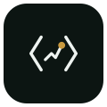
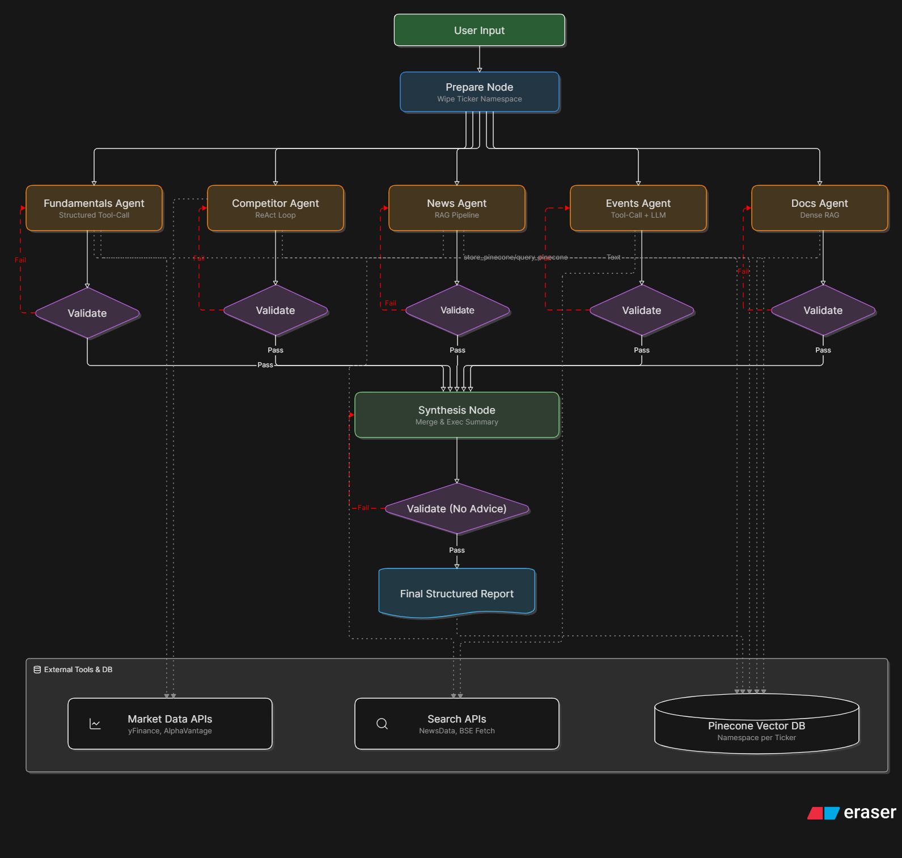
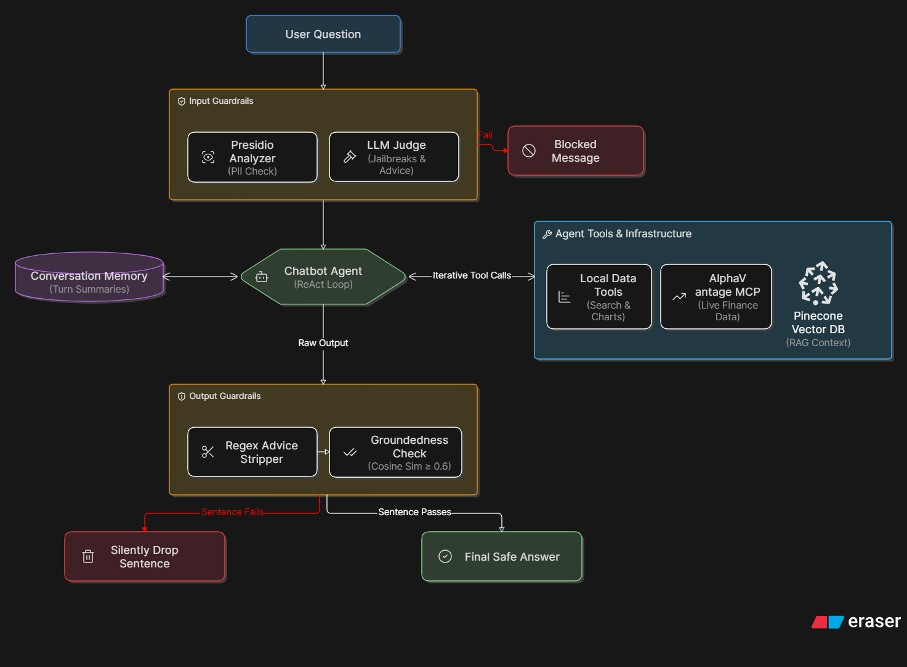
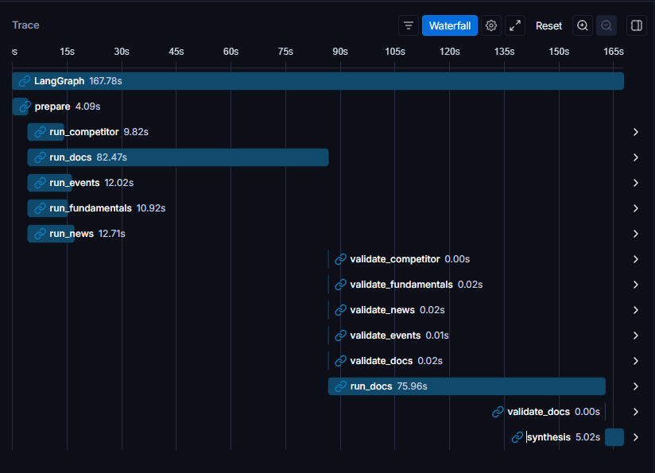

<div align="center">



# Multi-Agent Equity Analyst

**A multi-agent Indian-equity research system.** Five specialist LLM agents research an NSE stock in parallel, self-correct against a validation loop, and synthesize one cited report — then a guardrailed RAG + ReAct chatbot answers follow-up questions grounded only in what was indexed.


<!--  -->


</div>

> **Scope by design:** NSE/BSE equities only · read-only data everywhere · **no buy/sell/hold/recommend language anywhere** · every chatbot claim is cited or stripped. This is a research-skills demo, **not** investment advice.

<!-- ---

## 🎬 Demo

[](https://your-demo-video-link)

**▶️ Try it live:** [Multi-Agent Equity Analyst on 🤗 Spaces](https://huggingface.co/spaces/your-space)

<sub>Hosted on a free HuggingFace Space — it sleeps when idle and takes ~30s to wake on first request.</sub>

--- -->

## 💡 The Idea

Retail equity research is scattered across filings, concalls, news, and peer data — slow to assemble and easy to bias. This system treats research as an **orchestration problem**:

- **Specialist agents, not one mega-prompt** — competitor, news, events, financial docs, and fundamentals each run independently with the retrieval/tooling pattern that fits their job.
- **Self-correcting** — each agent's output is validated; a failed check feeds the reason back and retries once (2 attempts max) before the branch is marked partial and the report is assembled anyway.
- **Grounded or gone** — the chatbot answers only from the ticker's indexed namespace, and any sentence it can't trace to a retrieved source is stripped by the output guardrail.

---

## 🧠 What This Project Demonstrates

| Skill | Where it lives |
|---|---|
| **Multi-agent orchestration** | LangGraph parallel fan-out → deferred synthesis (`workflow/graph.py`) |
| **Self-correction / reflection** | Per-agent `run → validate → retry` loop, max 2 attempts (`workflow/nodes.py`, `workflow/edges.py`) |
| **RAG** | News & Financial Docs agents; chatbot retrieval (`agents/`, `chatbot/`) |
| **ReAct** | Competitor Intelligence agent + chatbot tool loop |
| **Tool-calling** | Event Timeline agent; 10 chatbot tools (`chatbot/chatbot_tools.py`) |
| **Rule-based guardrails** | Presidio PII + LLM judge (input); advice-strip + groundedness (output) (`guard/`) |
| **Reranking** | Pinecone top-k → Cohere rerank top-5 (`tools/rerank_tools.py`) |
| **MCP integration** | Alpha Vantage remote MCP tools via `langchain-mcp-adapters` |
| **Observability** | LangSmith traces per agent/turn, tagged `pass \| fixed \| blocked \| error` |

---

## 🏛️ Architecture — Agentic Report Workflow



A ticker fans out to **five specialists running in parallel**. Each is a two-step node — `run` then `validate` — and a conditional router either **retries** (injecting the validator's feedback, 2 attempts max) or **joins**. A branch that still fails after its retry joins as `failed_partial` rather than blocking the run. Synthesis is deferred until all five branches settle, then merges them into one structured report.

- **Shared Pinecone index** `stock-research` (serverless), **one namespace per ticker** (e.g. `HDFCBANK`), vectors tagged with `source_type` (`news \| docs \| events \| competitor \| report`). Each agent filters by its own `source_type`.
- **Embeddings:** NVIDIA NIM hosted `nvidia/nv-embed-v1` (4096-dim, requires `NVIDIA_API_KEY`).
- **Report ≠ guarded:** the synthesized report is **not** run through guardrails — agents rely on their system prompts for no-advice tone. Guardrails gate the **chatbot only** (below). This is a deliberate, honest scope choice.

| Agent | Pattern | Output section |
|---|---|---|
| Fundamentals | structured tool-calling | Company & Fundamentals |
| Competitor Intelligence | **ReAct** | Competitive Landscape |
| News Analysis | **RAG** | News Analysis |
| Event Timeline | tool-calling + LLM | Event Timeline |
| Financial Docs | **RAG** | Financial Documents |
| Synthesis | aggregation (no reasoning loop) | Executive Summary + merge |

---

## 💬 Architecture — Chatbot + Guardrails



Every turn is gated on **both** ends:

1. **Input guardrail** — Presidio PII detection (email, phone, PAN, Aadhaar, …) + a Groq `llama-3.1-8b-instant` judge classifying offensive / jailbreak / advice-request. Fails **closed**.
2. **ReAct agent** — up to 8 tool rounds over `search_research` (Pinecone k=10 → **Cohere rerank top-5**), live price, fundamentals, price history, charts, news, and Alpha Vantage MCP tools.
3. **Output guardrail** — advice language stripped by context-aware regex, then **per-sentence groundedness**: a sentence survives if it is the mandated refusal, reuses a number found in *this turn's* tool outputs, or clears **cosine ≥ 0.6** against them (only sentences failing the first two checks are embedded) — otherwise it's dropped.

---

## 🛡️ Guardrails in Action


| User asks | System does |
|---|---|
| *"Should I buy HDFC Bank right now?"* | **Blocked at input** — advice-request → safe refusal, no LLM call |
| *"What's my PAN ABCDE1234F's exposure?"* | **Blocked at input** — PII detected |
| *"HDFC Bank is a strong buy for the long term."* (model drifts) | **Stripped at output** — advice sentence removed before it reaches the user |
| *"What did management say about margins?"* (ungrounded guess) | **Stripped at output** — sentence with no source support is dropped |

---

## 🔍 Observability & Traceability

Every report run and chatbot turn is traced in **LangSmith**, tagged by ticker and guardrail outcome.


*Five specialist branches running in parallel*

---

## 🛠️ Tech Stack

| Layer | Technology |
|---|---|
| **Orchestration** | LangGraph (parallel fan-out + per-agent validate→retry) |
| **LLM (agents)** | Per-call ladder with backoff: Groq `llama-3.3-70b-versatile` → Groq `openai/gpt-oss-120b` → Gemini |
| **LLM (guard judge)** | Groq `llama-3.1-8b-instant` |
| **Vector store** | Pinecone serverless — namespace per ticker, `source_type` tags |
| **Embeddings** | NVIDIA NIM `nvidia/nv-embed-v1` (requires `NVIDIA_API_KEY`) |
| **Reranking** | Cohere Rerank |
| **Guardrails** | GuardrailsAI + Presidio (PII) + custom groundedness validator |
| **Tools / MCP** | yfinance, newsdata.io, Alpha Vantage (remote MCP), pdfplumber, plotly |
| **Observability** | LangSmith |
| **Frontend** | Streamlit + streamlit-searchbox · PDF via xhtml2pdf |

---

## 🚀 Quick Start (local)

```bash
git clone <repository-url>
cd Multi-Agent-Equity-Analyst

python -m venv .venv && source .venv/bin/activate   # Windows: .venv\Scripts\activate
pip install -r requirements.txt

cp .env.example .env        # then fill in your keys
```

Keys needed (all have free tiers): **Pinecone, Cohere, Groq, Gemini, newsdata.io, Alpha Vantage, NVIDIA, LangSmith** — see `.env.example` for the exact variable names.

```bash
# Generate a report headless (also indexes the ticker's namespace):
python -m workflow.graph RELIANCE.NS "Reliance Industries"

# Launch the app (report page + chatbot):
streamlit run app/main.py

# Run the tests:
pytest
```

> The chatbot for a ticker unlocks only **after** its report is generated (that's what populates the Pinecone namespace it reads from).

---

<details>
<summary><b>🗂️ Project Structure</b></summary>

<br>

```text
tools/        Shared library: pinecone, market (yfinance), fetch (news/BSE), rerank (Cohere)
guard/        Input guardrail (PII + LLM judge) · Output guardrail (advice-strip + groundedness)
templates/    Per-agent prompt templates + Pydantic input/output schemas
agents/       Five specialists + synthesis (one file each)
workflow/     LangGraph: state · nodes · edges (validate→retry) · graph · validator
chatbot/      RAG + ReAct session, 10 local tools + Alpha Vantage MCP, memory, CLI
utils/        LLM ladder · LangSmith tracing · config/cache/logging helpers
app/          Streamlit — main.py (report) + pages/1_Chatbot.py + PDF builder
tests/        pytest suite across every layer
```

</details>

<details>
<summary><b>⚙️ Design Decisions</b></summary>

<br>

- **Why guardrails on the chatbot only?** The report is generated once from controlled agent prompts; the chatbot is open-ended user input, where PII, jailbreaks, and advice-seeking actually arrive. Guarding the live surface is where it counts.
- **Why namespace-per-ticker?** Clean isolation and cheap teardown — each stock's `news/docs/events/competitor/report` chunks live together and are filtered by `source_type`, so agents never bleed context across tickers.
- **Why validate→retry instead of a critic agent?** A deterministic validator with feedback injection is cheaper and more predictable than an extra LLM reflection pass, and it keeps each branch self-contained for the parallel fan-out.
- **Why a three-tier LLM ladder?** Free-tier rate limits. A 429 on Groq 70b steps down to `gpt-oss-120b`; a 413 (prompt too large for either Groq bucket) skips straight to Gemini, which has the context window. The ladder is rebuilt per `invoke()` with no module-level provider state — five parallel branches can't race each other into a downgrade.

</details>

---

## 🔮 Roadmap

- **Critic agent** — a reflection pass verifying every report claim against its source before synthesis.
- **Event → Competitor A2A** — hand peer mentions from the Event agent to the Competitor agent.
- Broaden coverage beyond the current specialist set; richer chart tooling in the chatbot.

---

<div align="center">
<sub>Built to demonstrate multi-agent orchestration, RAG, guardrails, and observability — on Indian equities. Not investment advice.</sub>
</div>
